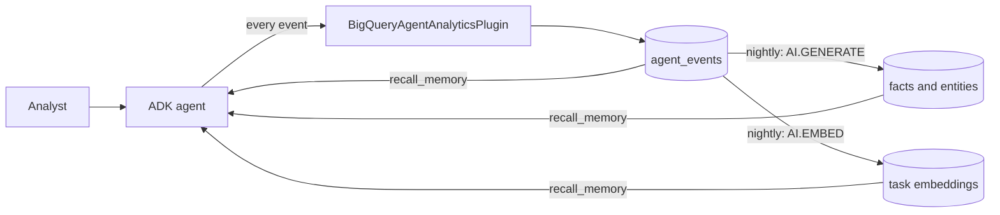

# Agent memory on BigQuery Agent Analytics

Neo4j Labs' [`neo4j-agent-memory`](https://github.com/neo4j-labs/agent-memory)
describes agent memory as three layers: short-term (conversations), long-term
(entities, preferences, facts) and reasoning (recorded steps, tool calls and
outcomes). This demo builds all three, plus a combined prompt context, from
the `agent_events` table that the ADK `BigQueryAgentAnalyticsPlugin` writes.
The agent needs no separate memory store:
- **Conversations and reasoning** are the logged rows themselves, read with
  `Client.list_traces`.
- **Preferences** are ADK `user:` state that the agent saves; the plugin logs
  each change as a `STATE_DELTA` row.
- **Facts and entities** are extracted from the logged messages by
  `AI.GENERATE` in BigQuery, each tied to the span of the message it came
  from.
- **Similar past tasks** are ranked with `AI.EMBED` and `ML.DISTANCE`.

Tracked in
[#511](https://github.com/GoogleCloudPlatform/BigQuery-Agent-Analytics-SDK/issues/511).


[Watch the narrated walkthrough (`recorded_run/demo.mp4`, 1 min 41 s)](recorded_run/demo.mp4).
Its captions are burned in and also in
[`recorded_run/demo.srt`](recorded_run/demo.srt); the voiceover script is
[`recorded_run/narration.md`](recorded_run/narration.md).

## The recorded week

[`analyst_agent.py`](analyst_agent.py) is an ADK data-analyst agent for
TheLook, the online clothing retailer in the public
`bigquery-public-data.thelook_ecommerce` dataset (about 125,000 orders). Its
tools run real, read-only BigQuery SQL. [`analyst_scenario.py`](analyst_scenario.py)
scripts five business days for six analysts, from merchandising, finance,
operations, growth, customer insights and category management. They state
their scope and definitions early in the week, then come back with
questions that only make sense with memory: "my categories", "the board
meeting", "the same lead-time check". The questions are scripted; the
answers, the SQL and every logged row are real.

The recorded run, on 2026-10-07 (details in
[`recorded_run/`](recorded_run/README.md)):
- **Volume:** 36 sessions with memory and 6 without, 46 turns, 1,606 rows in
  `analyst_events`, 220 SQL queries (171 of them in the sessions with
  memory, 2 of those failed).
- **Memory:** 23 facts and 62 entity mentions (32 distinct entities)
  extracted, 19 preference versions saved, 37 `recall_memory` calls.
- **Cost:** about $2.35, almost all of it Gemini tokens. The whole day on the
  project, with smoke runs and probes, came to about $2.76.

### Memory changes the answer

Six questions were also put, on the same day, to the same agent without its
memory tools. Both answers in each pair are the model's own. Only the first
three pairs are clean comparisons; in the other three, the run without
memory read the memory tables anyway (below).

| Analyst, day | Question | Without memory | With memory |
|---|---|---|---|
| Maya, merchandising, Monday | "How did my categories do last month?" | All 26 categories, men's and women's. 5 tool calls, 35 s | Her two women's categories by her net revenue definition: $39,355.24, up 20.78% on August. 2 tool calls, 22 s |
| Diego, growth, Wednesday | "How are my markets trending?" | Twelve countries by quarter, led by China. 6 tool calls, 100 s | Brazil and Spain, week by week from Monday, as he asked on Friday. 3 tool calls, 40 s |
| Priya, customer insights, Wednesday | "What should I bring to the business review?" | A company-wide KPI scorecard. 7 tool calls, 68 s | The 90-day repeat rate of her segment (customers aged 18 to 34) by cohort quarter, against customers 35 and over. 10 tool calls, 156 s |
| Lena, operations, Tuesday | "Run the same lead-time check for this month so far." | Not a clean control: read the memory tables (2 queries), then gave the same table as with memory. 4 tool calls, 31 s | Recalled her Thursday lead-time SQL and ran it for October 1 to 6: 32.22 hours from order to shipment in Memphis, 30.08 in Chicago. 5 tool calls, 45 s |
| Raj, FP&A, Wednesday | "What numbers do I need for the board meeting?" | Not a clean control: 9 of its 15 queries read the memory tables and logged rows, and one more failed; the same figures after 623 s and 480,000 tokens | Fiscal Q3 to date (his year starts February 1), in euros at his latest rate: net revenue €656,112.90. 7 tool calls, 74 s |
| Tom, category management, Wednesday | "Units yesterday for my categories and my watch brands?" | Not a clean control: 7 of its 16 queries read the memory tables and logged rows, and one more failed; the same table as with memory. 16 tool calls, 65 s | Outerwear & Coats 50 and Active 33 net units; Columbia 6 and The North Face 1. 4 tool calls, 33 s |

Memory did not always make the agent faster: Priya's answer took longer
because her segment needed a cohort analysis.

**Memory is data, so scope the tools.** Three of the six runs without memory
found the memory anyway. They listed tables and datasets through
`INFORMATION_SCHEMA`, found `bqaa_agent_memory_demo`, and read its tables
with `run_sql`: 2, 9 and 7 queries that returned rows. Raj's and Tom's also
read the logged
rows of the session with memory that had just answered the same question,
and repeated its numbers. The export flags these pairs
(`control_read_memory`), and the web view marks them "flawed control". Only
a query of the memory dataset that returned rows counts as a read. A query
that failed or that the guard refused read nothing; it is listed as an
attempt and does not flag the pair. `run_sql` now refuses any table
outside TheLook's dataset; the dry run lists every table a query reads. A
re-run of the six questions under that rule (`analyst_agent.py
--rerun-controls`) stopped after Maya's: that session
(`an-20261007t0834-d3-maya-2-ctl2`, 32 rows) is in the table but not in the
run record, which keeps the first-pass controls. In production, run the
agent's SQL tool as a service account that can read only the business data,
and protect memory tables like any other table.

### How memory is written and read



- **During a session.** The agent starts each conversation with
  `recall_memory`, which reads this analyst's memory from BigQuery and
  returns the `get_context()` block. When the analyst states a lasting
  preference or scope, the agent calls `save_preference`, which writes ADK
  `user:` state.
- **After each day.** [`memory_consolidation.py`](memory_consolidation.py)
  runs user messages through `AI.GENERATE` with a typed `output_schema`
  (entities with a type; facts as subject, predicate and object), and
  through `AI.EMBED`. Each night covers every session so far, but sends a
  message to the models only until it has a successful row: so it sends the
  day's new messages, and any that failed before, which are tried again the
  next night. The results go to `analyst_memory_items` and
  `analyst_task_embeddings`, keyed to the span of each message.
- **What recall returns.** Saved preferences (latest version), facts and
  entities, similar past tasks ranked by embedding with the SQL that
  answered them (a `reuse:` line), and tool calls that failed before. Every
  line names its source as `[session_id/span_id]`.

## Run it end to end

Use a scratch dataset. The recorded run cost about $2.35; see
[`recorded_run/`](recorded_run/README.md) for the breakdown.

1. **Run the week.**

   ```bash
   pip install "google-adk[bigquery-analytics]"   # the plugin's writer dependencies
   gcloud auth application-default login
   python examples/agent_memory/analyst_agent.py \
     --project-id PROJECT_ID --dataset-id bqaa_agent_memory_demo
   ```

   The agent runs on `gemini-3.8-flash` (Vertex AI location `global`). Each
   of its queries is a BigQuery job billed to `PROJECT_ID`, checked by a dry
   run (only `SELECT`, at most 2 GB scanned) and labeled
   `bqaa_demo=agent_memory`. `--days N` and `--user ID` run part of the
   week. The run record (sessions, transcript, comparisons, nightly passes,
   row counts and token usage) goes to `recorded_run/live_run.json`.

2. **Read one analyst's memory back.**

   ```bash
   python examples/agent_memory/agent_memory_demo.py \
     --project-id PROJECT_ID --dataset-id bqaa_agent_memory_demo \
     --table-id analyst_events --memory-tables analyst_ \
     --user-id maya.chen --session-id SESSION_ID
   ```

   `--memory-tables` adds the extracted facts and entities and ranks similar
   tasks by embedding, the same read `recall_memory` does. Readers never
   change a table. An embeddings table written before its `status` column
   existed, like the recorded run's, is read as it is: a non-empty
   embedding counts as successful. Only the week's runner adds the column.

3. **Export it for the web view and open it.**

   ```bash
   python examples/agent_memory/export_memory.py \
     --project-id PROJECT_ID --dataset-id bqaa_agent_memory_demo \
     --table-id analyst_events --memory-tables analyst_ \
     --run-record examples/agent_memory/recorded_run/live_run.json
   cd examples/agent_memory/viz && python -m http.server 8000
   # open http://localhost:8000/
   ```

   Browsers block local file reads from a `file://` page, so serve the
   folder. The export shows the project as `<project>` unless you pass
   `--show-project`.

4. **Record a narrated walkthrough (optional, macOS).** This needs
   `pip install playwright`, `python -m playwright install chromium` and
   ffmpeg.

   ```bash
   python examples/agent_memory/viz/record_demo.py \
     --narration examples/agent_memory/recorded_run/narration.md
   ```

   [`viz/record_demo.py`](viz/record_demo.py) drives the page in headless
   Chromium with video recording on. Each line of the script is spoken with
   the macOS `say` command, and each scene stays on screen until its lines
   end. The captions go to `demo.srt` next to the script and are burned into
   `demo.mp4` with ffmpeg's `overlay` filter, with the voiceover as its
   audio. The script names the export it narrates, and a different export is
   refused. Without `--narration`, the recorder writes a silent video with
   captions taken from the export.

## Offline quick start

```bash
# From the repository root, with the SDK installed (pip install -e .)
python examples/agent_memory/agent_memory_demo.py
```

The offline run needs no credentials or network. It replays
[`fixtures/agent_events.json`](fixtures/agent_events.json): 65 synthetic
rows of a small trip-planner agent, two users and five sessions, with all 16
`agent_events` columns the SDK reads and the payload keys the plugin writes.
The unit tests use the same rows. `offline_bigquery.py` stands in for
`google.cloud.bigquery.Client`, and the real `Client.list_traces` code path
runs on top of it. The stand-in implements exactly one statement: the SDK's
list-traces query, pinned in the file, with the `user_id`, `start_time` and
`limit` filters. Any other statement, a changed join, projection, ordering
or limit, another predicate, or an unexpected query parameter raises
`NotImplementedError` instead of returning rows a real query would not.

To browse the recorded week without a project, serve `viz/` as in step 3:
`viz/data/memory_export.json` is the export of the live run.

## The web view

[`viz/index.html`](viz/index.html) and [`viz/app.js`](viz/app.js) are plain
HTML and JavaScript with no dependencies. They read `viz/data/memory_export.json`:
- **Same question, with and without memory:** both answers side by side,
  with their tool calls, SQL queries, failures, time and tokens, and the
  earlier sessions the recall cited. A pair whose run without memory read
  the memory tables is marked "flawed control", with the queries' purposes.
- **The week:** every session by analyst and day. Arcs link the selected
  session to the earlier sessions its recall cited.
- **Sessions (short-term):** one analyst's sessions by day; pick one to see
  its conversation.
- **Long-term memory:** a graph of the analyst and the entities extracted
  from their messages, with the facts that link them; the facts as
  sentences; and each preference with its versions, a replaced one struck
  through. Every item opens the session it came from.
- **Reasoning:** one waterfall per turn: each model call, the tool calls it
  asked for, and how the turn ended. A failed tool call, including a query
  `run_sql` returned as an error, shows in the status color with an icon and
  a label.
- **What the agent read:** the memory `recall_memory` returned in the
  selected session.

Every chart has a table view, and the page follows the system dark mode. An
analyst switch shows that each analyst is read with their own `TraceFilter`.

## Where each layer comes from

| Layer | Source in BigQuery | Demo API (`memory_layers.py`) | neo4j-agent-memory |
|---|---|---|---|
| Short-term | `USER_MESSAGE_RECEIVED` (`content.text_summary`) and the text parts of `LLM_RESPONSE` (`content.response`) | `short_term.get_conversation(session_id)`, `short_term.list_sessions()` (with each session's logged state) | `short_term.get_conversation`, `list_sessions` |
| Long-term: preferences | `STATE_DELTA` rows for ADK `user:` keys (`attributes.state_delta`) | `long_term.get_preference_history()`, `long_term.get_preferences(as_of=...)` | `long_term.add_preference`, `supersede_preference`, `get_preferences_for(as_of=...)` |
| Long-term: facts | `AI.GENERATE` over `USER_MESSAGE_RECEIVED` rows (`memory_consolidation.py`) | `long_term.get_facts()` | `add_fact` (subject, predicate, object) |
| Long-term: entities | The same extraction, plus `TOOL_STARTING` arguments you map to an entity type | `long_term.get_entities()` (mentions keep their source: `extracted` or `tool`) | `long_term.add_entity`; extraction pipeline; `touched_entities` writes `(:ReasoningStep)-[:TOUCHED]->(:Entity)` |
| Reasoning | `LLM_RESPONSE`, `TOOL_STARTING` / `TOOL_COMPLETED` / `TOOL_ERROR`, `INVOCATION_COMPLETED`; one trace per `invocation_id` | `reasoning.get_trace_with_steps(trace_id)`, `get_session_traces`, `list_traces(success_only=, since=, until=)`, `get_similar_traces(scores=...)`, `get_tool_stats` | Written with `reasoning.start_trace` / `add_step` / `record_tool_call` / `complete_trace`; read with the same-named methods |
| Similarity | `AI.EMBED` of each task, `ML.DISTANCE` at recall (`memory_consolidation.similar_task_scores`) | `get_similar_traces(task, scores=...)`; word overlap when no scores are given | Vector similarity over embedded traces |
| Combined | All of the above; every line names its source rows as `[session_id/span_id]` | `get_context(query, session_id=..., scores=..., reuse_tools=...)` | `MemoryClient.get_context(query, session_id=...)` |

`load_user_memory(client, user_id, since=..., facts=..., extracted_entities=...)`
makes the single `Client.list_traces(TraceFilter(user_id=..., start_time=...))`
call and adds the extracted items it is given. The layers are then computed
from the returned `Trace` objects.

## Writing memory

The agent writes memory as a side effect of running with the plugin:
- **Conversations and reasoning traces:** every invocation's user message,
  model turns and tool calls.
- **Preferences:** written when a tool sets ADK user-scoped state:

```python
from google.adk.tools import ToolContext


def save_preference(key: str, value: str, tool_context: ToolContext) -> dict:
  """Remembers a lasting preference or scope of this user across sessions."""
  tool_context.state[f"user:{key}"] = value
  return {"status": "saved", "key": key, "value": value}
```

`user:` is ADK's prefix for state shared by all of a user's sessions. The
plugin logs the change as a `STATE_DELTA` row with
`attributes.state_delta = {"user:currency": "EUR"}`. A later write of the
same key starts a new version and closes the previous one, so the history
and `as_of` reads need no separate supersede call.

- **Facts, entities and embeddings:** written by the consolidation pass, in
  BigQuery, from rows the plugin already logged. `AI.GENERATE` and
  `AI.EMBED` report each row's outcome in a `status` column. A message
  counts as processed only once it has a successful row: an extraction with
  an empty status, or an embedding with an empty status and a non-empty
  vector. A failed attempt stays in its table with its status, the pass
  totals count the messages still failing, and the next pass tries those
  messages again. Items are keyed by span and position, and readers take
  the first successful row of each message, so re-running a pass never
  duplicates memory.

In neo4j-agent-memory the application records reasoning itself. Its docs
say "Always pair a started trace with a matching `complete_trace` call." Here
there is no trace lifecycle to manage, so there is no completion call to
forget. The status, however, is derived from the logged rows, not declared
by the application. A trace counts as answered only when its final answer
row was actually recorded; a stream that stopped part-way, for example, is
`unanswered` (see below).

## The reasoning-trace model

| neo4j-agent-memory | This demo | Derived from |
|---|---|---|
| `ReasoningTrace.task` | `ReasoningTrace.task` | The invocation's first `USER_MESSAGE_RECEIVED` |
| `ReasoningStep` (thought / action / observation) | `ReasoningStep` | One step per model call except the final answer; the fragments of a streamed call are one call. `thought` holds its text parts, `action` is `call: <tools>`, and `observation` summarizes the tool results or errors |
| `ToolCall` (status, `duration_ms`, `error`) | `ToolCall` (`success` / `error` / `pending`) | `TOOL_STARTING` paired by span id with `TOOL_COMPLETED` or `TOOL_ERROR`; `latency_ms.total_ms`; `error_message`. A start with no completion row is `pending`. A completion whose result is `{"status": "error", ...}`, the way the analyst's `run_sql` reports bad SQL, is an `error` |
| `complete_trace(outcome=TraceOutcome(success, summary, error_kind, metrics))` | `outcome`, `outcome_status`, `metrics` | `outcome` is the text of the last model call, if that call completed. `outcome_status` is one of `answered`, `answered_with_errors` or `unanswered`. `metrics` holds latency, model calls, tool calls and errors, and tokens (`content.usage.total`, the largest value per call, since streamed usage is cumulative) |
| `INITIATED_BY` / `TOUCHED` edges | `session_id` / `span_id` on every item | The source row |

How `outcome_status` is derived:
- `answered`: the invocation's last model call completed with text and no tool calls, and no row failed.
- `answered_with_errors`: the same final answer, but at least one row failed. The trace's `errors` lists why.
- `unanswered`: there is no recorded final answer. The invocation is still running, a stream stopped part-way, or it failed.

A row fails when it is an error row (an `*_ERROR` event, an error message or
status `ERROR`), or when it is a `TOOL_COMPLETED` row whose result reports
`{"status": "error"}`, the way `run_sql` returns bad SQL to the model. This
one rule, `memory_layers.row_error()`, sets each tool call's status, the
trace's `errors` and outcome, and the color of each tool bar in the web
view. So a turn that recovered from a failed query is answered with errors,
and `list_traces(success_only=True)` and `get_similar_traces()` leave it
out.

What counts as a completed model call:
- **Streaming.** A streamed model call writes several `LLM_RESPONSE` rows on one span. They are read as one call, and partial text never counts as an answer.
- **Terminal marker.** google-adk 2.11 marks the terminal response row with `attributes.cache_type` (and `finish_reason`); fragments carry neither. The marked row completes the call even if no later row has landed yet.
- **Older plugins.** These write no marker. A non-error row after the response (a tool call, the next model call, `AGENT_COMPLETED`) then shows that the call finished.
- **Incomplete calls.** A call with neither is incomplete, and appears as an incomplete reply in the conversation and the context.

How a response is read:
- **The format.** The plugin writes a response as `text: '...'`, `call: <tool>` and similar parts joined by ` | `, without escaping the text.
- **Ambiguous text.** Text that itself contains ` | call: x` can be read more than one way. A quote closes a text part only where ` | ` or the end follows it. The parser compares the structurally valid readings and uses the `TOOL_STARTING` rows that follow the call to choose between them.
- **No evidence.** Without tool rows, it keeps the text whole rather than inventing a tool call.
- **Truncated rows.** The plugin cuts an over-long payload and appends `...[TRUNCATED]`, so the last text part has no closing quote. That text is kept, marker included.
- **Bounded work.** The search for readings is capped, so crafted text cannot stall the reader. It tries whole-text readings first and, when tool rows exist, finely split ones too.

`success` means `answered`. It is an execution-level proxy, not proof that
the task succeeded.

`list_traces(success_only=...)` filters after the fetch on purpose.
`TraceFilter(has_error=False)` is a row-level predicate in the session-anchor
query, so it still returns sessions that contain error rows. See #511.

## Tool stats in SQL

`get_tool_stats()` aggregates the traces it loaded. Over the whole history,
the same numbers come from one query that can be sliced by any column:

```sql
SELECT
  JSON_VALUE(content, '$.tool') AS tool_name,
  COUNTIF(event_type = 'TOOL_STARTING') AS total_calls,
  COUNTIF(event_type = 'TOOL_COMPLETED'
          AND COALESCE(JSON_VALUE(content, '$.result.status'), '') != 'error')
    AS successful_calls,
  COUNTIF(event_type = 'TOOL_ERROR'
          OR (event_type = 'TOOL_COMPLETED'
              AND JSON_VALUE(content, '$.result.status') = 'error'))
    AS failed_calls,
  AVG(IF(event_type != 'TOOL_STARTING',
         CAST(JSON_VALUE(latency_ms, '$.total_ms') AS FLOAT64),
         NULL)) AS avg_duration_ms,
  MAX(IF(event_type = 'TOOL_STARTING', timestamp, NULL)) AS last_used_at
FROM `my-project.bqaa_agent_memory_demo.analyst_events`
WHERE event_type IN ('TOOL_STARTING', 'TOOL_COMPLETED', 'TOOL_ERROR')
  AND user_id = @user_id
  AND timestamp >= TIMESTAMP_SUB(CURRENT_TIMESTAMP(), INTERVAL 30 DAY)
GROUP BY tool_name
ORDER BY total_calls DESC, tool_name
```

On the recorded week, this query and `get_tool_stats()` agree for all six
analysts: the same total, successful and failed calls, and the same average
duration, for each of their four tools. `recall_memory` averaged about 4 s a
call and `run_sql` about 1.3 s.

## Compared with neo4j-agent-memory

**Where this approach differs:**
- **No recording calls.** The plugin's event log is the memory store; the
  agent adds nothing but ADK state.
- **Extraction in the warehouse.** Facts and entities come from one SQL
  statement over the logged rows (`AI.GENERATE` with a typed output
  schema), with no extraction service to run.
- **History for free.** The log is append-only, so preference history and
  `as_of` reads come from row timestamps.
- **SQL aggregation.** Aggregations such as tool stats run over the full
  table.
- **Provenance.** Every memory item points to the row it came from.
- **User scoping in SQL.** The `user_id` pin is applied in the query, so
  similar-task lookup only sees that user's traces. For comparison,
  neo4j-agent-memory's docs note that "Trace and step semantic searches are
  global: neither accepts a session filter."

The user pin is still a filter, not access control. Restrict who can read
the table with BigQuery IAM or row-level security.

**Where neo4j-agent-memory is stronger, and this demo does not claim parity:**
- **Graph queries.** Multi-hop queries over the entity graph. BigQuery Graph
  could hold the same graph, but running GQL needs an Enterprise or
  Enterprise Plus reservation; on this project's on-demand billing a probe
  query failed with exactly that error, so the demo uses plain SQL.
- **Entity resolution.** Here, names that differ only in case or spacing are
  merged; nothing more. neo4j-agent-memory deduplicates and resolves
  entities.
- **Write APIs and recorded outcomes.** Application-declared outcomes and
  provenance (`TraceOutcome`, `touched_entities`, `INITIATED_BY`), and write
  APIs for entities and facts.
- **Integrations.** A wide set of framework integrations.

## Limitations

- **Extraction runs after the fact.** Facts and entities from today's
  sessions appear after the nightly pass; preferences the agent saves are
  available at once.
- **Extraction is a model call.** Its facts are as good as the model's
  reading of each message, and it reads user messages only, not answers.
- **Everything loads at once.** One user's sessions (default: last 30 days,
  up to 100 sessions) are read into memory in a single call. Push filters
  into SQL for large histories.
- **Session ids must be unique.** A session id shared by two root agents or
  evaluation scopes raises `ValueError` rather than merging two
  conversations.
- **The days are simulated.** All sessions ran on one real day; each carries
  its simulated date in session state, and the agent treats that date as
  today. Rows keep their real timestamps.
- **Recall takes seconds.** `recall_memory` runs a few BigQuery queries and
  one `AI.EMBED`; it averaged about 4 s a call in the recorded run.
- **One run.** Each before/after pair is one sample, and three of the six
  controls are not clean (see above).

## Files

| File | What it is |
|---|---|
| `analyst_agent.py` | The live data-analyst agent, its tools, and the harness that runs the week |
| `analyst_scenario.py` | The six analysts, five days and the scripted questions |
| `memory_consolidation.py` | The nightly pass: `AI.GENERATE` extraction and `AI.EMBED` embeddings in BigQuery, and the loaders `recall_memory` uses |
| `memory_layers.py` | The three layers and `get_context`, computed from SDK `Trace` objects and extracted items |
| `agent_memory_demo.py` | CLI; offline by default, live with `--project-id/--dataset-id` |
| `export_memory.py` | Writes the web view's JSON from BigQuery or the fixture |
| `offline_bigquery.py` | Offline `bigquery.Client` stand-in that serves `Client.list_traces` from the fixture and fails closed |
| `fixtures/agent_events.json` | The synthetic rows behind the offline run and the unit tests |
| `viz/index.html`, `viz/app.js` | The web view |
| `viz/data/memory_export.json` | The export of the recorded week |
| `viz/record_demo.py` | Records the walkthrough and `viz/screenshot.png` with headless Chromium; `--narration` adds a voiceover and burned-in captions |
| `recorded_run/` | The recorded week: run record, demo output, the narrated walkthrough with its script and captions, and a labeled note |

Hermetic tests are in [`tests/examples/`](../../tests/examples/):
- `test_agent_memory_demo.py`: the memory layers, the CLI and the stand-in client;
- `test_agent_memory_analyst.py`: the agent's tools, the scenario and the consolidation SQL;
- `test_agent_memory_export.py`: the export;
- `test_agent_memory_recording.py`: the narration script, captions and
  ffmpeg command of the recorder.

## Sources

All fetched 2026-10-06; neo4j-agent-memory 0.6.0.

- Understanding the three memory types: https://neo4j.com/labs/agent-memory/explanation/memory-types/
- Reasoning-traces how-to: https://neo4j.com/labs/agent-memory/how-to/reasoning-traces/ (now titled "Record and verify a failed tool call")
- API reference: [trace operations](https://neo4j.com/labs/agent-memory/reference/api/reasoning-traces/), [steps and tool calls](https://neo4j.com/labs/agent-memory/reference/api/reasoning-steps/), [search and stats](https://neo4j.com/labs/agent-memory/reference/api/reasoning-search-stats/), [MemoryClient](https://neo4j.com/labs/agent-memory/reference/api/memory-client/), [preferences and facts](https://neo4j.com/labs/agent-memory/reference/api/long-term-preferences/)
- Repository: https://github.com/neo4j-labs/agent-memory
- PyPI: https://pypi.org/project/neo4j-agent-memory/
- TheLook data: `bigquery-public-data.thelook_ecommerce` (BigQuery public datasets)
