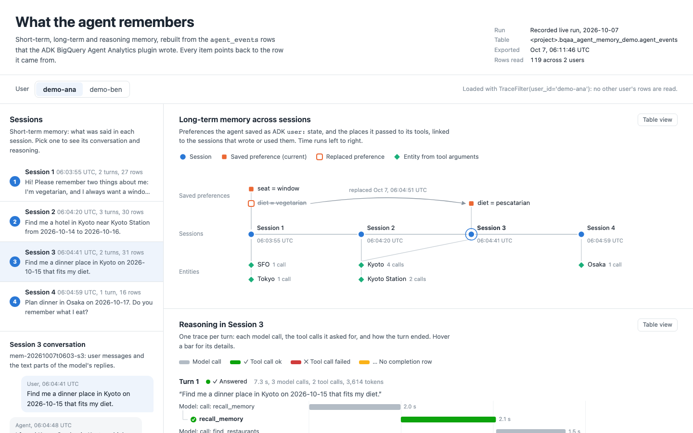

# Agent memory on BigQuery Agent Analytics

Neo4j Labs' [`neo4j-agent-memory`](https://github.com/neo4j-labs/agent-memory)
describes agent memory as three layers: short-term (conversations), long-term
(entities, preferences, facts) and reasoning (recorded steps, tool calls and
outcomes). This demo reads the same three layers, plus a combined prompt
context, out of the `agent_events` table that the ADK
`BigQueryAgentAnalyticsPlugin` writes. It uses only existing SDK APIs:
`Client.list_traces`, `TraceFilter`, `Trace` and `Span`, plus
`make_bq_client` in live mode. Tracked in
[#511](https://github.com/GoogleCloudPlatform/BigQuery-Agent-Analytics-SDK/issues/511).

> **Two kinds of data.**
> - **Offline:** the run and the tests replay
>   [`fixtures/agent_events.json`](fixtures/agent_events.json), 65 synthetic
>   rows for two users and five sessions of a trip-planner agent. The rows
>   have all 16 `agent_events` columns the SDK reads, with the payload keys
>   the plugin writes.
> - **Live:** a real end-to-end run is recorded in
>   [`recorded_run/`](recorded_run/README.md). A live ADK agent on Vertex AI
>   wrote 119 rows to BigQuery, and the demo, the export and the web view below
>   read them back.



[Watch the 63-second walkthrough (`demo.mp4`)](demo.mp4) of the web view on the
recorded run.

## Run it

```bash
# From the repository root, with the SDK installed (pip install -e .)
python examples/agent_memory/agent_memory_demo.py
```

The offline run needs no credentials or network. `offline_bigquery.py` stands
in for `google.cloud.bigquery.Client`, and the real `Client.list_traces` code
path runs on top of it. The stand-in serves only that one statement, with the
`user_id`, `start_time` and `limit` filters; any other query or predicate
raises `NotImplementedError` instead of returning rows a real query would
have excluded.

To read a live table written by the plugin (Application Default
Credentials):

```bash
python examples/agent_memory/agent_memory_demo.py \
  --project-id my-project --dataset-id agent_analytics \
  --user-id USER_ID --session-id CURRENT_SESSION_ID \
  --entity-arg city=LOCATION --entity-arg customer_id=CUSTOMER
```

`--entity-arg` names the tool arguments that hold entities. The default
mapping fits the fixture's trip-planner tools. Other options:
- `--query`: the task to match against past traces;
- `--trace-id`: a trace to print in full;
- `--lookback-days`: how far back to read (default 30);
- `--table-id`: the events table (default `agent_events`).

An abridged excerpt of the offline output:

```text
Agent memory from BigQuery Agent Analytics traces
source : offline fixture (synthetic rows) examples/agent_memory/fixtures/agent_events.json
user   : u-ana   current session: s-104   now: 2026-10-06T16:00:00Z
read   : 4 sessions, 4 traces from one Client.list_traces() call
         TraceFilter(user_id='u-ana', start_time=2026-09-06T16:00:00Z)
...
== 2. Long-term memory ==
Preference history (ADK user: state from STATE_DELTA rows):
  diet = vegetarian    2026-09-28T17:00:01Z -> 2026-10-04T18:00:01Z  s-101
  seat = window        2026-09-28T17:00:01Z -> current               s-101
  diet = pescatarian   2026-10-04T18:00:01Z -> current               s-103
...
== 3. Reasoning memory ==
...
Trace inv-102 (session s-102): answered_with_errors
  task   : Book a hotel in Kyoto near Kyoto Station for Oct 14 to 16.
  step 1 : call: search_hotels
           search_hotels  error  5003 ms  TimeoutError: hotel inventory API did not respond within 5000 ms
  step 2 : call: search_hotels
           search_hotels  success  820 ms
  outcome: Sakura Station Hotel is 150 m from Kyoto Station at $180 per night. Shall I book it?
  metrics: latency_ms=9323 llm_calls=3 tool_calls=2 tool_errors=1 total_tokens=1540
...
== 4. get_context() for the next model call ==
# Memory for user u-ana

## Short-term: current conversation (session s-104)
- user: Find a restaurant in Osaka for dinner that fits my diet. [s-104/sp-104-inv]

## Long-term: user preferences (ADK user: state)
- diet = pescatarian (since 2026-10-04T18:00:01Z; replaced vegetarian) [s-103/sp-103-agent]
- seat = window (since 2026-09-28T17:00:01Z) [s-101/sp-101-agent]

## Long-term: entities the agent acted on
- Kyoto (LOCATION): 3 tool calls in s-102, s-103
- Kyoto Station (LOCATION): 2 tool calls in s-102
- SFO (LOCATION): 1 tool call in s-101
- Tokyo (LOCATION): 1 tool call in s-101

## Reasoning: similar past tasks that succeeded
- 0.31 "I eat fish now, so update my diet to pescatarian. Find a restaurant in Kyoto for dinner on Oct 15." -> save_preference, find_restaurants -> "Updated your diet to pescatarian. Kamo Grill in Kyoto has pescatarian dinner options on Oct 15." [s-103/inv-103]

## Reasoning: tools that failed before
- search_hotels failed 1 of 2 calls; last error: TimeoutError: hotel inventory API did not respond within 5000 ms [s-102/sp-102-tool-1]
```

The second user in the fixture, `u-ben`, asked an almost identical Osaka
question and stored `diet = vegan` under the same key. None of it appears in
`u-ana`'s memory, because the user pin is applied in the `list_traces` SQL.
Run with `--user-id u-ben --session-id s-201` to see that user's view.

## Run it end to end

This is the full loop on your own project: a live agent writes memory, then
the demo, the export and the web view read it back. Use a scratch dataset.
Cost depends on your rates; the recorded run cost about $0.05 (see
[`recorded_run/`](recorded_run/README.md)).

1. **Run the agent.**

   ```bash
   pip install "google-adk[bigquery-analytics]"   # the plugin's writer dependencies
   gcloud auth application-default login
   python examples/agent_memory/live_agent.py \
     --project-id PROJECT_ID --dataset-id bqaa_agent_memory_demo \
     --record /tmp/live_run.json
   ```

   [`live_agent.py`](live_agent.py) creates the dataset if it is missing. It
   then runs five scripted sessions on `gemini-3.8-flash` (Vertex AI location
   `global`), with the `BigQueryAgentAnalyticsPlugin` writing every event
   (`enable_otel_correlation=True`). Two users take part, and the sessions
   exercise the main memory paths:
   - multi-turn context within a session;
   - preferences saved as ADK `user:` state, one of them later replaced;
   - a simulated hotel-inventory outage (a real `TOOL_ERROR`) that the next
     turn retries;
   - two `recall_memory` calls, where the agent reads its earlier sessions
     back from BigQuery through `load_user_memory()` and `get_context()`.

   The run record (session IDs, row counts, transcript) goes to `--record`.

2. **Read the memory back.** Take the session IDs from the run record.

   ```bash
   python examples/agent_memory/agent_memory_demo.py \
     --project-id PROJECT_ID --dataset-id bqaa_agent_memory_demo \
     --user-id demo-ana --session-id mem-RUN_TAG-s5
   ```

3. **Export it for the web view and open it.**

   ```bash
   python examples/agent_memory/export_memory.py \
     --project-id PROJECT_ID --dataset-id bqaa_agent_memory_demo \
     --user-id demo-ana --user-id demo-ben
   cd examples/agent_memory/viz && python -m http.server 8000
   # open http://localhost:8000/
   ```

   Browsers block local file reads from a `file://` page, so serve the folder.
   The export shows the project as `<project>` unless you pass
   `--show-project`. Running `export_memory.py` without `--project-id`
   exports the offline fixture instead.

4. **Record a walkthrough (optional).** This needs
   `pip install playwright`, `python -m playwright install chromium` and
   ffmpeg.

   ```bash
   python examples/agent_memory/viz/record_demo.py
   ```

   [`viz/record_demo.py`](viz/record_demo.py) serves the folder on a local
   port and drives the page in headless Chromium with video recording on. It
   writes `demo.mp4` and `viz/screenshot.png`, and writes its captions from the
   export.

## The web view

[`viz/index.html`](viz/index.html) and [`viz/app.js`](viz/app.js) are plain
HTML and JavaScript with no dependencies. They read `viz/data/memory_export.json`:
- **Sessions (short-term):** one entry per session; pick one to see its
  conversation.
- **Long-term memory across sessions:** a graph with sessions on a time line.
  Saved preferences sit above it; a replaced version is struck through and
  linked to its successor. Entities from tool arguments sit below it, linked
  to every session that used them. Hover any node for its source row.
- **Reasoning:** one waterfall per turn. It shows each model call, the tool
  calls that call asked for, and how the turn ended. A failed tool call shows
  in the status color with an icon and a label.
- **What the agent reads next:** the `get_context()` block for the latest
  session.

Every chart has a table view, and the page follows the system dark mode. A
user switch shows that each user is read with their own `TraceFilter`.

## Where each layer comes from

| Layer | Rows the plugin writes | Demo API (`memory_layers.py`) | neo4j-agent-memory |
|---|---|---|---|
| Short-term | `USER_MESSAGE_RECEIVED` (`content.text_summary`) and the text parts of `LLM_RESPONSE` (`content.response`) | `short_term.get_conversation(session_id)`, `short_term.list_sessions()` | `short_term.get_conversation`, `list_sessions` |
| Long-term: preferences | `STATE_DELTA` rows for ADK `user:` keys (`attributes.state_delta`) | `long_term.get_preference_history()`, `long_term.get_preferences(as_of=...)` | `long_term.add_preference`, `supersede_preference`, `get_preferences_for(as_of=...)` |
| Long-term: entities | `TOOL_STARTING` arguments that you map to an entity type | `long_term.get_entities()` | `long_term.add_entity`; `touched_entities` writes `(:ReasoningStep)-[:TOUCHED]->(:Entity)` |
| Reasoning | `LLM_RESPONSE`, `TOOL_STARTING` / `TOOL_COMPLETED` / `TOOL_ERROR`, `INVOCATION_COMPLETED`; one trace per `invocation_id` | `reasoning.get_trace_with_steps(trace_id)`, `get_session_traces`, `list_traces(success_only=, since=, until=)`, `get_similar_traces`, `get_tool_stats` | Written with `reasoning.start_trace` / `add_step` / `record_tool_call` / `complete_trace`; read with the same-named methods |
| Combined | All of the above | `get_context(query, session_id=...)` | `MemoryClient.get_context(query, session_id=...)` |

`load_user_memory(client, user_id, since=...)` makes the single
`Client.list_traces(TraceFilter(user_id=..., start_time=...))` call. The
three layers are then computed from the returned `Trace` objects.

## Writing memory

Nothing in this demo writes memory. The agent writes it as a side effect of
running with the plugin:
- **Conversations and reasoning traces:** every invocation's user message,
  model turns and tool calls.
- **Preferences:** written when a tool sets ADK user-scoped state:

```python
from google.adk.tools import ToolContext


def save_preference(key: str, value: str, tool_context: ToolContext) -> dict:
  """Remembers a user preference across sessions."""
  tool_context.state[f"user:{key}"] = value
  return {"status": "saved", "key": key}
```

`user:` is ADK's prefix for state shared by all of a user's sessions. The
plugin logs the change as a `STATE_DELTA` row with
`attributes.state_delta = {"user:diet": "vegetarian"}`. A later write of the
same key starts a new version and closes the previous one, so the history
and `as_of` reads need no separate supersede call. The long-term layer
ignores session-scoped keys (no prefix), such as `last_hotel_search` in the
fixture.

In neo4j-agent-memory the application records reasoning itself. Its docs
say "Always pair a started trace with a matching `complete_trace` call." Here
there is no trace lifecycle to manage, so a trace cannot be left without an
outcome. The cost is that the outcome is inferred from the logged rows (see
below), not declared by the application.

## The reasoning-trace model

| neo4j-agent-memory | This demo | Derived from |
|---|---|---|
| `ReasoningTrace.task` | `ReasoningTrace.task` | The invocation's first `USER_MESSAGE_RECEIVED` |
| `ReasoningStep` (thought / action / observation) | `ReasoningStep` | One step per model turn except the final answer. `thought` holds its text parts, `action` is `call: <tools>`, and `observation` summarizes the tool results or errors |
| `ToolCall` (status, `duration_ms`, `error`) | `ToolCall` (`success` / `error` / `pending`) | `TOOL_STARTING` paired by span id with `TOOL_COMPLETED` or `TOOL_ERROR`; `latency_ms.total_ms`; `error_message`. A start with no completion row is `pending` |
| `complete_trace(outcome=TraceOutcome(success, summary, error_kind, metrics))` | `outcome`, `outcome_status`, `metrics` | `outcome` is the text of the last model turn. `outcome_status` is one of `answered`, `answered_with_errors` or `unanswered`. `metrics` holds latency, LLM calls, tool calls and errors, and tokens (`content.usage.total`) |
| `INITIATED_BY` / `TOUCHED` edges | `session_id` / `span_id` on every item | The source row |

How `outcome_status` is derived:
- `answered`: the invocation ends with a text answer and recorded no error rows.
- `answered_with_errors`: it ends with a text answer, but at least one error row was recorded (such as the retried hotel search above).
- `unanswered`: it ends without a text answer, because it is still running or was cut off.

`success` means `answered`. It is an execution-level proxy, not proof that
the task succeeded.

`list_traces(success_only=...)` filters after the fetch on purpose.
`TraceFilter(has_error=False)` is a row-level predicate in the session-anchor
query, so it still returns sessions that contain error rows. See #511.

## Tool stats in SQL

`get_tool_stats()` aggregates the traces it loaded. Over the whole history,
the same numbers come from one query that can be sliced by any column:

```sql
SELECT
  JSON_VALUE(content, '$.tool') AS tool_name,
  COUNTIF(event_type = 'TOOL_STARTING') AS total_calls,
  COUNTIF(event_type = 'TOOL_COMPLETED') AS successful_calls,
  COUNTIF(event_type = 'TOOL_ERROR') AS failed_calls,
  SAFE_DIVIDE(
    COUNTIF(event_type = 'TOOL_COMPLETED'),
    COUNTIF(event_type = 'TOOL_STARTING')) AS success_rate,
  AVG(IF(event_type != 'TOOL_STARTING',
         CAST(JSON_VALUE(latency_ms, '$.total_ms') AS FLOAT64),
         NULL)) AS avg_duration_ms,
  MAX(IF(event_type = 'TOOL_STARTING', timestamp, NULL)) AS last_used_at
FROM `my-project.agent_analytics.agent_events`
WHERE event_type IN ('TOOL_STARTING', 'TOOL_COMPLETED', 'TOOL_ERROR')
  AND user_id = @user_id
  AND timestamp >= TIMESTAMP_SUB(CURRENT_TIMESTAMP(), INTERVAL 30 DAY)
GROUP BY tool_name
ORDER BY total_calls DESC, tool_name
```

This query returns the same rows as `get_tool_stats()` in two checks:
- on the recorded live table in BigQuery, for `demo-ana` (0 bytes billed);
- on the fixture, transpiled to DuckDB with sqlglot.

## Compared with neo4j-agent-memory

**Where this approach differs:**
- **No recording calls.** The plugin's event log is the memory store.
- **History for free.** The log is append-only, so preference history and
  `as_of` reads come from row timestamps.
- **SQL aggregation.** Aggregations such as tool stats run over the full
  table.
- **Provenance.** Every memory item points to the row it came from.
- **User scoping in SQL.** The `user_id` pin is applied in the query, so
  similar-task lookup only sees that user's traces. For comparison,
  neo4j-agent-memory's docs note that "Trace and step semantic searches are
  global: neither accepts a session filter."

The user pin is still a filter, not access control. Restrict who can read
the table with BigQuery IAM or row-level security.

**Where neo4j-agent-memory is stronger, and this demo does not claim parity:**
- Application-declared outcomes and provenance (`TraceOutcome`,
  `touched_entities`, `INITIATED_BY`).
- Embedding similarity for messages, entities and traces.
- Entity resolution and deduplication.
- Write APIs for entities and subject-predicate-object facts.
- Multi-hop graph queries.
- A wide set of framework integrations.

## Limitations

- **Similarity is lexical.** `get_similar_traces` uses Jaccard overlap of
  content words, so it runs without a model. The SDK's
  `BigQueryEpisodicMemory` can rank user messages with `ML.DISTANCE` over a
  precomputed embeddings table; that path is not exercised here.
- **Entities come only from mapped tool arguments.** For LLM extraction from
  payloads, see `ContextGraphManager.extract_biz_nodes` (`AI.GENERATE`) in
  [SDK.md](../../SDK.md).
- **Everything loads at once.** One user's sessions (default: last 30 days,
  up to 100 sessions) are read into memory in a single call. Push filters
  into SQL for large histories.
- **Session ids must be unique.** A session id shared by two root agents or
  evaluation scopes raises `ValueError` rather than merging two
  conversations.
- **The live agent is a demo.** Its inventories are fake and its outage is
  simulated. The model's replies vary from run to run, so a rerun can call
  tools differently from the recorded one.

## Files

| File | What it is |
|---|---|
| `agent_memory_demo.py` | CLI; offline by default, live with `--project-id/--dataset-id` |
| `memory_layers.py` | The three layers and `get_context`, computed from SDK `Trace` objects |
| `offline_bigquery.py` | Offline `bigquery.Client` stand-in that serves `Client.list_traces` from the fixture and fails closed |
| `fixtures/agent_events.json` | The synthetic rows |
| `live_agent.py` | Live ADK trip planner that writes the memory (and reads it back with `recall_memory`) |
| `export_memory.py` | Writes the web view's JSON from BigQuery or the fixture |
| `viz/index.html`, `viz/app.js` | The web view |
| `viz/data/memory_export.json` | The export from the recorded run |
| `viz/record_demo.py` | Records `demo.mp4` and `viz/screenshot.png` with headless Chromium |
| `recorded_run/` | The recorded live run: run record, demo output and a labeled note |

Hermetic tests are in [`tests/examples/`](../../tests/examples/):
- `test_agent_memory_demo.py`: the memory layers, the CLI and the stand-in client;
- `test_agent_memory_live_agent.py`: the agent's tools;
- `test_agent_memory_export.py`: the export.

## Sources

All fetched 2026-10-06; neo4j-agent-memory 0.6.0.

- Understanding the three memory types: https://neo4j.com/labs/agent-memory/explanation/memory-types/
- Reasoning-traces how-to: https://neo4j.com/labs/agent-memory/how-to/reasoning-traces/ (now titled "Record and verify a failed tool call")
- API reference: [trace operations](https://neo4j.com/labs/agent-memory/reference/api/reasoning-traces/), [steps and tool calls](https://neo4j.com/labs/agent-memory/reference/api/reasoning-steps/), [search and stats](https://neo4j.com/labs/agent-memory/reference/api/reasoning-search-stats/), [MemoryClient](https://neo4j.com/labs/agent-memory/reference/api/memory-client/), [preferences and facts](https://neo4j.com/labs/agent-memory/reference/api/long-term-preferences/)
- Repository: https://github.com/neo4j-labs/agent-memory
- PyPI: https://pypi.org/project/neo4j-agent-memory/
